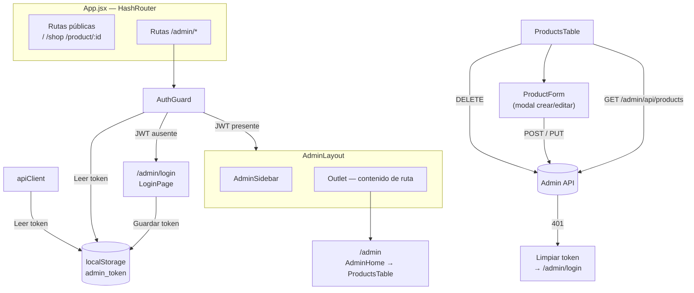
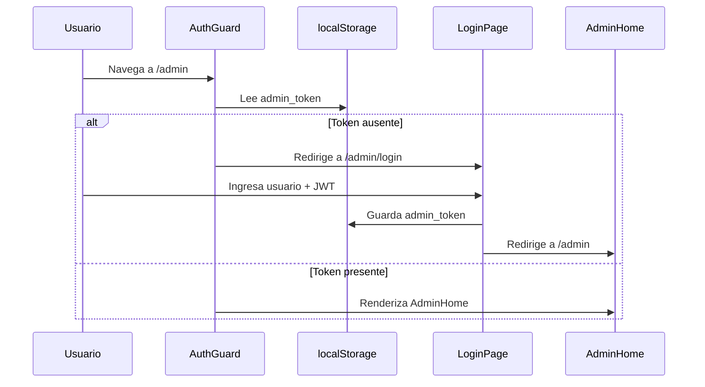

# Diseño Técnico — Módulo de Administración (admin-module)

## Overview

El módulo de administración añade una sección protegida en `/admin` a la SPA existente de Petal & Bloom. Permite a los administradores autenticados gestionar el catálogo de productos (CRUD completo) a través de una interfaz coherente con el diseño de la tienda.

La implementación se integra en la arquitectura React + Vite existente sin introducir nuevas dependencias de producción. Reutiliza el sistema de i18n (`useLocale` / `t()`), las variables CSS globales y las convenciones de estructura de componentes ya establecidas.

### Decisiones de diseño clave

- **Autenticación por JWT en localStorage**: el requisito especifica explícitamente `localStorage` bajo la clave `admin_token`. No se usa `httpOnly cookie` para no requerir cambios en el backend.
- **Sin librería de estado global**: el estado de autenticación se lee directamente de `localStorage` en cada guard/petición. Esto es suficiente para un panel de administración de uso individual.
- **Rutas bajo `/admin`**: se añaden como sub-rutas dentro del `HashRouter` existente en `App.jsx`, manteniendo la compatibilidad con el despliegue estático actual.
- **`apiClient` centralizado**: una función utilitaria que inyecta el JWT y maneja el 401 automáticamente, evitando duplicación en cada componente.

---

## Architecture



### Flujo de autenticación



---

## Components and Interfaces

### Árbol de componentes

```
src/components/
├── AdminAuthGuard.jsx/.css     # Protege rutas /admin/*
├── AdminLayout.jsx/.css        # Shell con sidebar + <Outlet>
├── AdminSidebar.jsx/.css       # Navegación lateral contraíble
├── AdminLogin.jsx/.css         # Página de inicio de sesión
├── AdminHome.jsx/.css          # Página principal → monta ProductsTable
├── ProductsTable.jsx/.css      # Tabla CRUD de productos
└── ProductForm.jsx/.css        # Modal crear/editar producto
```

### `AdminAuthGuard`

```jsx
// Protege rutas de administración
// Props: ninguna — lee localStorage internamente
// Renderiza: <Outlet> si autenticado, <Navigate to="/admin/login"> si no
export default function AdminAuthGuard()
```

### `AdminLayout`

```jsx
// Shell que compone sidebar + contenido
// Props: ninguna
// Renderiza: <AdminSidebar> + <Outlet>
export default function AdminLayout()
```

### `AdminSidebar`

```jsx
// Props: ninguna — estado collapsed gestionado internamente
// Estado: collapsed (boolean), inicializado a true si viewport ≤ 900px
export default function AdminSidebar()
```

| Estado | Descripción |
|--------|-------------|
| `collapsed` | `boolean` — controla si el sidebar muestra solo íconos o íconos + texto |

### `AdminLogin`

```jsx
// Props: ninguna
// Estado: username (string), token (string), error (string|null)
export default function AdminLogin()
```

### `ProductsTable`

```jsx
// Props: ninguna — obtiene JWT de localStorage vía apiClient
// Estado: products[], loading, error, showForm, editingProduct
export default function ProductsTable()
```

### `ProductForm`

```jsx
// Props:
//   product: object|null  — null = modo creación, objeto = modo edición
//   onClose: () => void   — cierra el modal
//   onSaved: () => void   — recarga la lista tras guardar
export default function ProductForm({ product, onClose, onSaved })
```

### `apiClient` (utilidad)

```js
// src/utils/apiClient.js
// Función que envuelve fetch() inyectando el JWT y manejando 401
// Firma:
export async function apiRequest(path, options = {})
// - Lee admin_token de localStorage
// - Añade Authorization: Bearer <token>
// - Si la respuesta es 401: elimina token y redirige a /admin/login
// - Lanza error para otros códigos no-2xx
```

### Integración en `App.jsx`

```jsx
// Nuevas rutas a añadir dentro del HashRouter existente:
<Route path="/admin/login" element={<AdminLogin />} />
<Route path="/admin" element={<AdminAuthGuard />}>
  <Route element={<AdminLayout />}>
    <Route index element={<AdminHome />} />
  </Route>
</Route>
```

---

## Data Models

### JWT en localStorage

```
localStorage.getItem('admin_token') → string | null
```

El token se almacena como string plano. No se parsea ni valida en el cliente más allá de verificar que no sea `null` o vacío.

### Producto (respuesta del API)

```ts
interface Product {
  id: string | number
  name: string
  price: number | null
  description: string | null
  images: ProductImage[]
}

interface ProductImage {
  url: string
  displayOrder: number
}
```

### Payload de creación / edición

```ts
interface ProductPayload {
  name: string        // requerido, no vacío
  price: number       // requerido
  description: string // requerido
}
```

### Estado del formulario (`ProductForm`)

```ts
interface FormState {
  name: string
  price: string       // string para el input, se convierte a number al enviar
  description: string
  error: string | null
  saving: boolean
}
```

### Claves de traducción nuevas

Todas las claves se añaden a los cuatro idiomas (`es`, `en`, `fr`, `ko`) en `src/i18n/translations.js`:

| Prefijo | Claves |
|---------|--------|
| `admin.login` | `admin.login.title`, `admin.login.username`, `admin.login.token`, `admin.login.submit`, `admin.login.error.required`, `admin.login.error.unauthorized` |
| `admin.sidebar` | `admin.sidebar.products`, `admin.sidebar.collapse`, `admin.sidebar.expand` |
| `admin.products` | `admin.products.title`, `admin.products.add`, `admin.products.edit`, `admin.products.delete`, `admin.products.confirm`, `admin.products.cancel`, `admin.products.save`, `admin.products.loading`, `admin.products.error`, `admin.products.empty`, `admin.products.col.name`, `admin.products.col.price`, `admin.products.col.description`, `admin.products.col.image`, `admin.products.col.actions`, `admin.products.form.title.create`, `admin.products.form.title.edit`, `admin.products.error.save`, `admin.products.error.delete` |
| `admin.logout` | `admin.logout.button` |


---

## Correctness Properties

*Una propiedad es una característica o comportamiento que debe mantenerse verdadero en todas las ejecuciones válidas del sistema — esencialmente, una declaración formal sobre lo que el sistema debe hacer. Las propiedades sirven como puente entre las especificaciones legibles por humanos y las garantías de corrección verificables por máquina.*

### Property 1: Guard redirige a login cuando no hay token

*Para cualquier* estado de la aplicación en el que `localStorage` no contenga la clave `admin_token` (o su valor sea nulo/vacío), renderizar `AdminAuthGuard` debe producir una redirección a `/admin/login` y no renderizar el contenido protegido.

**Validates: Requirements 1.1, 1.4**

---

### Property 2: Guard redirige a home cuando hay token

*Para cualquier* string no vacío almacenado como `admin_token` en `localStorage`, intentar renderizar la ruta `/admin/login` debe producir una redirección a `/admin`.

**Validates: Requirements 1.2, 1.3**

---

### Property 3: Login rechaza campos vacíos o solo whitespace

*Para cualquier* combinación de `(username, token)` donde al menos uno de los dos sea una cadena vacía o compuesta únicamente de espacios en blanco, hacer clic en "Iniciar Sesión" debe: (a) no almacenar nada en `localStorage`, y (b) mostrar un mensaje de error en la UI.

**Validates: Requirements 2.2, 2.3**

---

### Property 4: Login persiste el token en localStorage

*Para cualquier* par `(username, token)` donde ambos campos sean no vacíos, al hacer clic en "Iniciar Sesión" el valor de `localStorage.getItem('admin_token')` debe ser igual al token introducido por el usuario.

**Validates: Requirements 2.4, 2.5**

---

### Property 5: Logout elimina el token y redirige

*Para cualquier* token almacenado en `localStorage` bajo `admin_token`, al hacer clic en el botón de "Cerrar Sesión", `localStorage.getItem('admin_token')` debe ser `null` y la aplicación debe redirigir a `/admin/login`.

**Validates: Requirements 3.2, 3.3**

---

### Property 6: apiClient inyecta el JWT en todas las peticiones

*Para cualquier* token almacenado en `localStorage` bajo `admin_token` y cualquier llamada a `apiRequest()` (GET, POST, PUT o DELETE), la petición resultante debe incluir el header `Authorization: Bearer <token>` con el valor exacto del token almacenado.

**Validates: Requirements 5.1, 6.4, 7.3, 8.3, 9.1, 9.3**

---

### Property 7: La tabla renderiza todos los productos recibidos

*Para cualquier* array de productos devuelto por el API, `ProductsTable` debe renderizar exactamente tantas filas como productos haya en el array, y cada fila debe contener el nombre y el precio del producto correspondiente.

**Validates: Requirements 5.2**

---

### Property 8: Acciones por fila coinciden con el número de productos

*Para cualquier* array de N productos (N ≥ 1), `ProductsTable` debe renderizar exactamente N botones de "Editar" y N botones de "Eliminar".

**Validates: Requirements 7.1, 8.1**

---

### Property 9: Formulario de edición precarga los datos del producto

*Para cualquier* producto con campos `name`, `price` y `description`, al abrir `ProductForm` en modo edición con ese producto, los campos del formulario deben contener exactamente los valores del producto recibido como prop.

**Validates: Requirements 7.2**

---

### Property 10: Respuesta 401 limpia el token y redirige

*Para cualquier* petición al Admin API que retorne un código HTTP 401, `apiClient` debe: (a) eliminar `admin_token` de `localStorage`, y (b) redirigir la aplicación a `/admin/login`.

**Validates: Requirements 9.2**

---

### Property 11: Claves de traducción completas en los cuatro idiomas

*Para cualquier* clave bajo los prefijos `admin.login`, `admin.sidebar`, `admin.products` y `admin.logout` definida en el objeto `translations`, los cuatro idiomas (`es`, `en`, `fr`, `ko`) deben tener esa clave definida con un valor no vacío.

**Validates: Requirements 10.2**

---

## Error Handling

### Errores de autenticación

| Situación | Comportamiento |
|-----------|---------------|
| Token ausente al navegar a `/admin` | `AdminAuthGuard` redirige a `/admin/login` sin mostrar contenido |
| Campos vacíos en login | Mensaje de error inline, sin petición al backend |
| Respuesta 401 en cualquier petición | `apiClient` limpia `localStorage` y redirige a `/admin/login` |

### Errores de red / API

| Situación | Comportamiento |
|-----------|---------------|
| GET `/admin/api/products` falla | `ProductsTable` muestra mensaje de error (`admin.products.error`) |
| POST falla al crear producto | `ProductForm` muestra error inline, permanece abierto |
| PUT falla al editar producto | `ProductForm` muestra error inline, permanece abierto |
| DELETE falla al eliminar producto | `ProductsTable` muestra mensaje de error, lista no se recarga |
| Error de red (sin conexión) | Mismo tratamiento que error HTTP no-2xx |

### Estrategia de `apiClient`

```js
// Pseudocódigo del manejo de errores en apiRequest()
const res = await fetch(url, { headers: { Authorization: `Bearer ${token}` }, ...options })
if (res.status === 401) {
  localStorage.removeItem('admin_token')
  window.location.hash = '/admin/login'
  throw new Error('Unauthorized')
}
if (!res.ok) throw new Error(`HTTP ${res.status}`)
return res.json()
```

Los componentes capturan el error con `try/catch` y actualizan su estado de error local. No se usa un error boundary global para el módulo de administración.

---

## Testing Strategy

### Enfoque dual: unit tests + property-based tests

Ambos tipos son complementarios y necesarios:

- **Unit tests**: verifican ejemplos concretos, estados de UI específicos y casos de error.
- **Property tests**: verifican propiedades universales sobre rangos de inputs generados aleatoriamente.

### Librería de property-based testing

El proyecto ya incluye **`fast-check`** (`^4.6.0`) en `devDependencies`. Se usará junto con **Vitest** (ya configurado) para todos los property tests.

### Configuración de property tests

- Mínimo **100 iteraciones** por propiedad (configurado con `{ numRuns: 100 }` en `fc.assert`).
- Cada test debe incluir un comentario de trazabilidad:
  ```js
  // Feature: admin-module, Property N: <texto de la propiedad>
  ```
- Cada propiedad del diseño debe implementarse en **un único** property test.

### Unit tests (ejemplos y casos de error)

| Componente | Qué testear |
|------------|-------------|
| `AdminAuthGuard` | Renderiza `<Navigate>` sin token; renderiza `<Outlet>` con token |
| `AdminLogin` | Formulario tiene dos campos; botón submit presente |
| `AdminLogin` | Muestra error con campos vacíos (Req 2.3) |
| `AdminLogin` | Muestra error con campos solo whitespace |
| `AdminSidebar` | Contiene enlace "Productos" (Req 4.2) |
| `AdminSidebar` | Colapsado por defecto en viewport ≤ 900px (Req 11.2) |
| `ProductsTable` | Muestra skeleton/loading mientras carga (Req 5.3) |
| `ProductsTable` | Muestra mensaje de error si GET falla (Req 5.4) |
| `ProductsTable` | Muestra mensaje vacío si lista es [] (Req 5.5) |
| `ProductsTable` | Muestra botón "Agregar Producto" (Req 6.1) |
| `ProductsTable` | Clic en "Agregar" abre `ProductForm` en modo creación (Req 6.2) |
| `ProductForm` | Tiene campos nombre, precio y descripción (Req 6.3) |
| `ProductForm` | Clic en "Cancelar" cierra sin petición (Req 6.7) |
| `ProductForm` | Muestra error si POST falla (Req 6.6) |
| `ProductForm` | Muestra error si PUT falla (Req 7.5) |
| `ProductsTable` | Clic en "Eliminar" muestra diálogo de confirmación (Req 8.2) |
| `ProductsTable` | Cancelar diálogo no dispara petición (Req 8.6) |
| `ProductsTable` | Muestra error si DELETE falla (Req 8.5) |
| `AdminHome` | Muestra botón "Cerrar Sesión" (Req 3.1) |
| `AdminSidebar` | Clic en "Productos" navega a vista de productos (Req 4.6) |
| i18n | Cambio de idioma actualiza textos del módulo admin (Req 10.3) |

### Property tests (propiedades universales)

Cada test referencia la propiedad del diseño con el comentario de trazabilidad:

| Property | Descripción resumida | fast-check arbitraries |
|----------|---------------------|----------------------|
| Property 1 | Guard redirige sin token | `fc.option(fc.string(), { nil: null })` para simular ausencia de token |
| Property 2 | Guard redirige con token desde login | `fc.string({ minLength: 1 })` como token |
| Property 3 | Login rechaza campos vacíos/whitespace | `fc.tuple(fc.string(), fc.string())` filtrando al menos uno vacío |
| Property 4 | Login persiste token en localStorage | `fc.tuple(fc.string({ minLength: 1 }), fc.string({ minLength: 1 }))` |
| Property 5 | Logout limpia token y redirige | `fc.string({ minLength: 1 })` como token inicial |
| Property 6 | apiClient inyecta JWT en todas las peticiones | `fc.string({ minLength: 1 })` como token + `fc.constantFrom('GET','POST','PUT','DELETE')` |
| Property 7 | Tabla renderiza todos los productos | `fc.array(productArbitrary, { minLength: 0, maxLength: 50 })` |
| Property 8 | N productos → N botones editar + N eliminar | `fc.array(productArbitrary, { minLength: 1, maxLength: 20 })` |
| Property 9 | Formulario precarga datos del producto | `productArbitrary` con campos name, price, description |
| Property 10 | 401 limpia token y redirige | `fc.string({ minLength: 1 })` como token + mock fetch que retorna 401 |
| Property 11 | Claves de traducción completas en 4 idiomas | Iteración sobre todas las claves `admin.*` del objeto translations |

### Estructura de archivos de test

```
src/components/
├── AdminAuthGuard.test.jsx
├── AdminLogin.test.jsx
├── AdminSidebar.test.jsx
├── AdminHome.test.jsx
├── ProductsTable.test.jsx
└── ProductForm.test.jsx
src/utils/
└── apiClient.test.js
src/i18n/
└── adminTranslations.test.js   # Property 11
```
