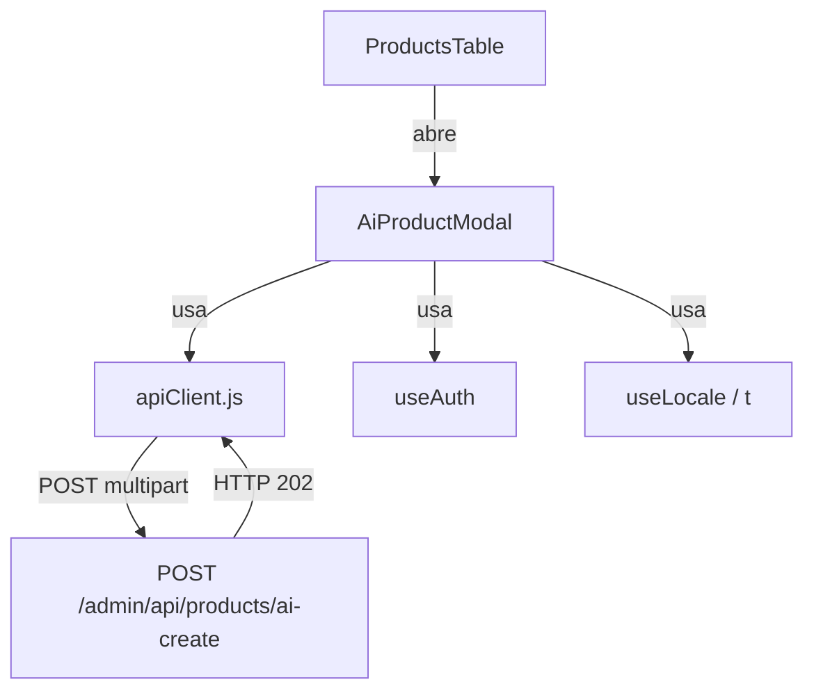
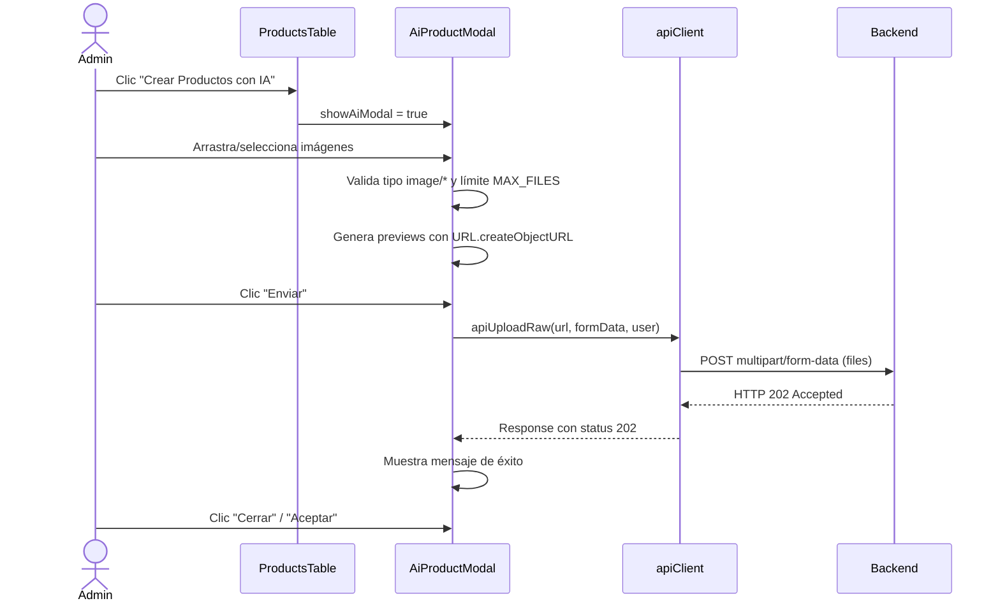

# Documento de Diseño — Modal de Creación de Productos con IA

## Resumen

Este documento describe el diseño técnico del modal de creación de productos con IA. El componente permite a los administradores cargar múltiples imágenes mediante drag-and-drop o selector de archivos, validar el límite configurado, enviarlas al endpoint `POST /admin/api/products/ai-create` como `multipart/form-data`, y manejar la respuesta asíncrona HTTP 202.

El diseño se integra al ecosistema existente: reutiliza el patrón de modal de `ProductForm.jsx`, la función `apiUpload` de `apiClient.js` (con una modificación menor para soportar respuestas no-JSON), el sistema de autenticación Firebase vía `useAuth()`, y el sistema i18n con claves en los 4 locales.

## Arquitectura

### Diagrama de Componentes



### Flujo de Interacción



### Decisión de Diseño: Manejo de HTTP 202 en apiClient

El endpoint de IA devuelve HTTP 202 Accepted, posiblemente sin cuerpo JSON. La función `apiUpload` actual siempre llama `res.json()`, lo cual fallaría con un cuerpo vacío o no-JSON.

**Opción elegida**: Crear una nueva función `apiUploadRaw` en `apiClient.js` que retorne el objeto `Response` nativo en lugar de parsear JSON automáticamente. Esto:
- No rompe el contrato existente de `apiUpload` (usado por `ProductForm.jsx`)
- Permite al modal inspeccionar `response.status === 202` directamente
- Mantiene la lógica de inyección de token y reintento en 401
- Es la solución más limpia y con menor riesgo de regresión

## Componentes e Interfaces

### 1. `AiProductModal` (nuevo componente)

**Archivo**: `src/components/AiProductModal.jsx` + `src/components/AiProductModal.css`

**Props**:
```ts
interface AiProductModalProps {
  onClose: () => void   // Callback para cerrar el modal
}
```

**Estado interno**:
```ts
files: File[]              // Archivos seleccionados por el usuario
previews: string[]         // URLs de blob para thumbnails
dragOver: boolean          // Indica si se está arrastrando sobre la zona
sending: boolean           // Envío en progreso
result: 'success' | 'error' | null  // Resultado del envío
error: string | null       // Mensaje de error (límite excedido, fallo de red, etc.)
```

**Constantes**:
```js
const MAX_FILES = Number(import.meta.env.VITE_AI_MAX_FILES) || 10
const AI_ENDPOINT = ADMIN_API_URL.replace(/\/products$/, '/products/ai-create')
```

**Comportamiento clave**:
- Acepta archivos vía `onDrop` y vía `<input type="file" accept="image/*" multiple>`
- Filtra archivos no-imagen silenciosamente (solo acepta `type.startsWith('image/')`)
- Si agregar archivos supera `MAX_FILES`, rechaza los excedentes y muestra error i18n
- Genera previews con `URL.createObjectURL`, los revoca en cleanup
- Al enviar: construye `FormData` con `formData.append('files', file)` por cada archivo
- Llama `apiUploadRaw(AI_ENDPOINT, formData, user)`
- Si `response.status === 202` → muestra estado éxito
- Si otro status → muestra estado error
- En estado éxito: botón "Aceptar" cierra el modal
- En estado error: botones "Reintentar" y "Cerrar"

### 2. Modificación a `ProductsTable.jsx`

- Agregar estado `showAiModal` (boolean)
- Agregar botón "Crear Productos con IA" junto al botón "Agregar Producto" en la cabecera
- Renderizar `<AiProductModal>` condicionalmente cuando `showAiModal === true`

### 3. Nueva función `apiUploadRaw` en `apiClient.js`

```js
export async function apiUploadRaw(path, formData, user) {
  // Misma lógica de token + retry 401 que apiUpload
  // Retorna el Response nativo en lugar de res.json()
}
```

### 4. Claves i18n nuevas en `translations.js`

Prefijo: `admin.ai.` — se agregan a los 4 locales (es, en, fr, ko).

Claves requeridas:
- `admin.ai.button` — Texto del botón en ProductsTable
- `admin.ai.title` — Título del modal
- `admin.ai.dropzone` — Texto de la zona de carga
- `admin.ai.dropzone.active` — Texto cuando se arrastra sobre la zona
- `admin.ai.browse` — Texto del enlace/botón para abrir selector
- `admin.ai.counter` — Patrón del contador (ej: "{count} / {max}")
- `admin.ai.error.limit` — Error de límite excedido
- `admin.ai.error.send` — Error genérico de envío
- `admin.ai.error.type` — Error de tipo de archivo no válido
- `admin.ai.send` — Texto del botón enviar
- `admin.ai.sending` — Texto durante envío
- `admin.ai.success` — Mensaje de éxito
- `admin.ai.accept` — Botón aceptar (post-éxito)
- `admin.ai.retry` — Botón reintentar
- `admin.ai.close` — Botón cerrar
- `admin.ai.remove` — Aria-label para eliminar imagen

## Modelos de Datos

### Archivos en el modal

No se introduce un modelo de datos persistente nuevo. El estado es efímero dentro del componente:

```js
// Cada archivo es un File nativo del browser
// Las previews son strings de URL.createObjectURL
// El FormData se construye al momento del envío:
const formData = new FormData()
files.forEach(file => formData.append('files', file))
```

### Comunicación con el backend

**Request**:
- Método: `POST`
- URL: `{ADMIN_API_URL}/ai-create` (derivado de `VITE_ADMIN_API_URL`)
- Content-Type: `multipart/form-data` (automático por el browser)
- Headers: `Authorization: Bearer {firebase_token}`
- Body: Cada archivo como campo `files` separado

**Response esperada**:
- Éxito: HTTP 202 Accepted (cuerpo puede estar vacío o ser JSON mínimo)
- Error: HTTP 4xx/5xx con cuerpo de error opcional

### Variable de entorno

| Variable | Tipo | Default | Descripción |
|---|---|---|---|
| `VITE_AI_MAX_FILES` | number | 10 | Límite máximo de archivos por carga |


## Propiedades de Correctitud

*Una propiedad es una característica o comportamiento que debe cumplirse en todas las ejecuciones válidas de un sistema — esencialmente, una declaración formal sobre lo que el sistema debe hacer. Las propiedades sirven como puente entre especificaciones legibles por humanos y garantías de correctitud verificables por máquinas.*

### Propiedad 1: Completitud de claves i18n

*Para cualquier* clave i18n utilizada por el modal de IA (prefijo `admin.ai.*`), dicha clave debe existir en los 4 mapas de locale (es, en, fr, ko) con un valor de tipo string no vacío.

**Valida: Requisitos 1.3, 2.10, 5.5**

### Propiedad 2: Filtro exclusivo de imágenes

*Para cualquier* archivo con tipo MIME que no comience con `image/`, el sistema debe rechazarlo y no agregarlo a la lista de archivos. *Para cualquier* archivo con tipo MIME que comience con `image/`, el sistema debe aceptarlo (si no se excede el límite).

**Valida: Requisito 2.5**

### Propiedad 3: Invariante de lista de archivos y previews

*Para cualquier* secuencia de operaciones de agregar y eliminar archivos, la cantidad de previews renderizados siempre debe ser igual a la cantidad de archivos en la lista. Además, *para cualquier* lista de N archivos y cualquier índice válido i, eliminar el archivo en la posición i debe producir una lista de N-1 archivos donde el archivo eliminado ya no está presente.

**Valida: Requisitos 2.7, 2.8**

### Propiedad 4: Cumplimiento del límite de archivos

*Para cualquier* límite MAX_FILES y cualquier intento de agregar M archivos cuando ya hay C archivos cargados, si C + M > MAX_FILES entonces solo se aceptan MAX_FILES - C archivos y se muestra un mensaje de error. Además, *para cualquier* estado donde la cantidad de archivos sea igual a MAX_FILES, el mecanismo de agregar archivos debe estar deshabilitado.

**Valida: Requisitos 3.3, 3.4**

### Propiedad 5: Precisión del contador de archivos

*Para cualquier* cantidad de archivos cargados N y cualquier límite máximo M, el contador debe mostrar exactamente el texto "{N} / {M}".

**Valida: Requisito 3.5**

### Propiedad 6: Construcción correcta de FormData

*Para cualquier* lista de N archivos de imagen, el FormData construido para el envío debe contener exactamente N entradas, todas con la clave `files`, y cada entrada debe corresponder a uno de los archivos originales.

**Valida: Requisito 4.1**

### Propiedad 7: Botón de envío deshabilitado sin archivos

*Para cualquier* estado del modal donde la lista de archivos esté vacía, el botón de envío debe estar deshabilitado.

**Valida: Requisito 4.5**

### Propiedad 8: Respuesta no-202 muestra error

*Para cualquier* código de estado HTTP diferente de 202 retornado por el endpoint, el modal debe mostrar un mensaje de error y no mostrar el estado de éxito.

**Valida: Requisito 5.2**

## Manejo de Errores

| Escenario | Comportamiento | Clave i18n |
|---|---|---|
| Archivos no-imagen en drop/select | Se ignoran silenciosamente, no se agregan a la lista | — |
| Exceder límite MAX_FILES | Se rechazan los excedentes, se muestra error temporal | `admin.ai.error.limit` |
| Sin archivos al intentar enviar | Botón de envío deshabilitado (prevención) | — |
| Error de red / timeout | Se muestra mensaje de error, se habilitan botones "Reintentar" y "Cerrar" | `admin.ai.error.send` |
| HTTP 401 (token expirado) | `apiUploadRaw` reintenta automáticamente con token fresco (misma lógica que `apiUpload`) | — |
| HTTP 4xx/5xx (no 202) | Se muestra mensaje de error, se habilitan botones "Reintentar" y "Cerrar" | `admin.ai.error.send` |
| Usuario no autenticado | `apiUploadRaw` lanza error (no debería ocurrir ya que el admin panel requiere auth) | — |

### Limpieza de recursos

- Los URLs de blob creados con `URL.createObjectURL` se revocan al eliminar archivos individuales y al desmontar el componente (vía `useEffect` cleanup).
- El estado del modal se reinicia completamente al cerrar.

## Estrategia de Testing

### Enfoque dual

Se utilizan tests unitarios basados en ejemplos para verificar comportamientos específicos de UI, y tests basados en propiedades (PBT) para verificar invariantes universales.

### Librería PBT

Se usará **fast-check** (`fc`) para los tests basados en propiedades, ejecutando un mínimo de 100 iteraciones por propiedad.

### Tests basados en propiedades

Cada propiedad del documento de diseño se implementa como un test PBT individual:

| Propiedad | Estrategia de generación |
|---|---|
| P1: i18n completitud | Generar claves del prefijo `admin.ai.*`, verificar existencia en 4 locales |
| P2: Filtro de imágenes | Generar MIME types aleatorios (image/* y no-image), verificar aceptación/rechazo |
| P3: Invariante archivos/previews | Generar secuencias de operaciones add/remove, verificar count match |
| P4: Límite de archivos | Generar límites N y cantidades M, verificar enforcement |
| P5: Contador | Generar pares (count, max), verificar formato de salida |
| P6: FormData | Generar listas de archivos mock, verificar entradas en FormData |
| P7: Envío sin archivos | Generar estados con lista vacía, verificar botón deshabilitado |
| P8: Respuesta no-202 | Generar status codes != 202, verificar mensaje de error |

Cada test PBT debe incluir un comentario de referencia:
```
// Feature: ai-product-creation, Property {N}: {título}
```

### Tests unitarios (ejemplos)

- Renderizado del botón "Crear Productos con IA" en ProductsTable (Req 1.1)
- Apertura del modal al hacer clic en el botón (Req 1.2)
- Atributos ARIA del modal: `role="dialog"`, `aria-modal="true"` (Req 2.1)
- Botón de cierre visible y funcional (Req 2.2)
- Drag-and-drop agrega archivos (Req 2.3)
- Selector de archivos agrega archivos (Req 2.4)
- Indicación visual durante drag-over (Req 2.6)
- Lectura de VITE_AI_MAX_FILES y default 10 (Req 3.1, 3.2)
- Indicador de carga y botones deshabilitados durante envío (Req 4.3, 4.4)
- Mensaje de éxito con botón "Aceptar" en HTTP 202 (Req 5.1, 5.3)
- Botones "Reintentar" y "Cerrar" en error (Req 5.4)

### Tests de integración

- Verificar que `apiUploadRaw` inyecta el token de Firebase y reintenta en 401 (Req 4.2)
- Verificar flujo completo: seleccionar archivos → enviar → recibir 202 → cerrar modal
