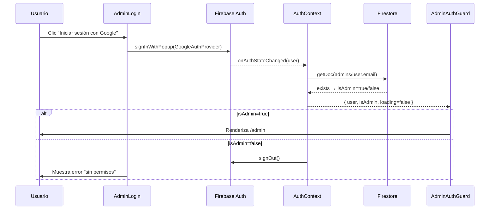
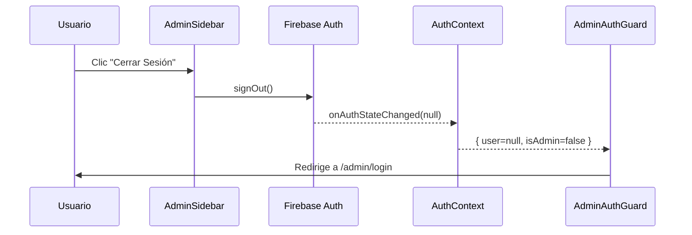

# Diseño Técnico — Firebase Google Auth

## Overview

Este documento describe el diseño técnico para migrar el sistema de autenticación del panel de administración de Petal & Bloom desde el esquema actual (usuario + JWT manual en `localStorage`) a Google OAuth gestionado por Firebase Authentication.

La SPA en React 19 + Vite no tiene backend propio. Firebase Authentication gestiona el flujo OAuth con Google y emite JWTs firmados. Firestore actúa como fuente de verdad para el control de acceso: la colección `admins` determina qué emails de Google tienen rol de administrador.

### Decisiones de diseño clave

- **Auth Context como única fuente de verdad**: todos los componentes leen el estado de autenticación desde `AuthContext`, nunca directamente de Firebase ni de `localStorage`. Esto desacopla la UI de la implementación de Firebase y facilita el testing.
- **`onAuthStateChanged` como driver reactivo**: el contexto se suscribe al observable de Firebase y actualiza el estado de forma reactiva. No hay polling ni verificación manual.
- **Verificación de admin en Firestore por email**: el documento ID en la colección `admins` es el email del usuario. Una consulta `getDoc(doc(db, 'admins', user.email))` es suficiente — sin reglas de rol complejas.
- **`getIdToken()` en cada petición**: el `apiClient` llama a `user.getIdToken()` antes de cada petición. Firebase renueva el token automáticamente si está próximo a expirar, sin lógica adicional en el cliente.
- **Eliminación completa del sistema anterior**: no coexisten dos mecanismos de autenticación. Se eliminan todas las referencias a `admin_token` en `localStorage`.

---

## Architecture

```mermaid
graph TD
    subgraph App.jsx [App.jsx — HashRouter]
        AuthProvider[AuthProvider\nsrc/firebase/AuthContext.jsx]
        PublicRoutes["Rutas públicas\n/ /shop /product/:id"]
        AdminRoutes["Rutas /admin/*"]
    end

    AuthProvider --> AdminRoutes
    AdminRoutes --> AuthGuard[AdminAuthGuard]
    AuthGuard -->|"user=null o isAdmin=false"| LoginPage["/admin/login\nAdminLogin"]
    AuthGuard -->|"loading=true"| Spinner[Indicador de carga]
    AuthGuard -->|"isAdmin=true"| AdminLayout

    subgraph AdminLayout [AdminLayout]
        Sidebar[AdminSidebar\nbotón Cerrar Sesión]
        Outlet[Outlet — contenido de ruta]
    end

    Outlet --> AdminHome["/admin\nAdminHome → ProductsTable"]

    LoginPage -->|"signInWithPopup"| FirebaseAuth[(Firebase Auth\nGoogle OAuth)]
    FirebaseAuth -->|"onAuthStateChanged"| AuthProvider
    AuthProvider -->|"getDoc(admins/email)"| Firestore[(Firestore\ncolección admins)]

    Sidebar -->|"signOut()"| FirebaseAuth
    AdminHome -->|"apiRequest()"| ApiClient[apiClient\ngetIdToken()]
    ApiClient -->|"Authorization: Bearer JWT"| AdminAPI[(Admin API\n/admin/api/products)]
    AdminAPI -->|"401"| ApiClient
    ApiClient -->|"getIdToken(true) + retry"| AdminAPI
```

### Flujo de autenticación



### Flujo de cierre de sesión



---

## Components and Interfaces

### Nuevos archivos y modificaciones

```
src/
├── firebase/
│   ├── firebaseConfig.js       # Inicialización de Firebase App, Auth y Firestore
│   └── AuthContext.jsx         # AuthProvider + useAuth hook
└── components/
    ├── AdminAuthGuard.jsx      # MODIFICADO: lee AuthContext en lugar de localStorage
    ├── AdminLogin.jsx          # MODIFICADO: botón Google OAuth, elimina formulario
    ├── AdminSidebar.jsx        # MODIFICADO: botón Cerrar Sesión llama a signOut()
    └── AdminLogin.css          # MODIFICADO: estilos para botón Google
src/utils/
    └── apiClient.js            # MODIFICADO: getIdToken() en lugar de localStorage
```

### `firebaseConfig.js`

```js
// src/firebase/firebaseConfig.js
// Inicializa Firebase una única vez. Lanza error si faltan variables de entorno.
// Exporta: auth (FirebaseAuth), db (Firestore)
export const auth   // FirebaseAuth instance
export const db     // Firestore instance
```

Valida en tiempo de inicialización que las cuatro variables requeridas estén presentes:
`VITE_FIREBASE_API_KEY`, `VITE_FIREBASE_AUTH_DOMAIN`, `VITE_FIREBASE_PROJECT_ID`, `VITE_FIREBASE_APP_ID`.

### `AuthContext.jsx`

```jsx
// src/firebase/AuthContext.jsx
// Contexto que expone el estado de autenticación a toda la app.

// Forma del contexto:
interface AuthContextValue {
  user: FirebaseUser | null   // objeto de usuario de Firebase o null
  loading: boolean            // true mientras onAuthStateChanged no ha resuelto
  isAdmin: boolean            // true si el email del usuario existe en admins/
  signInWithGoogle: () => Promise<void>
  logout: () => Promise<void>
}

export function AuthProvider({ children })  // envuelve la app en App.jsx
export function useAuth()                   // hook para consumir el contexto
```

**Lógica interna de `AuthProvider`:**
1. Suscribe a `onAuthStateChanged(auth, callback)` en el montaje; cancela la suscripción en el desmontaje.
2. Cuando `user` cambia a no-nulo: consulta `getDoc(doc(db, 'admins', user.email))` y actualiza `isAdmin`.
3. Cuando `user` cambia a `null`: establece `isAdmin = false` sin consultar Firestore.
4. `loading` es `true` hasta que `onAuthStateChanged` dispara por primera vez.

### `AdminAuthGuard` (modificado)

```jsx
// Lee { user, loading, isAdmin } desde useAuth() — sin acceso a localStorage ni Firebase directo.
// loading=true  → renderiza <LoadingSpinner>
// !user || !isAdmin → <Navigate to="/admin/login" replace />
// isAdmin && ruta=/admin/login → <Navigate to="/admin" replace />
// isAdmin → <Outlet />
export default function AdminAuthGuard()
```

### `AdminLogin` (modificado)

```jsx
// Elimina el formulario usuario/token.
// Muestra un único botón que llama a signInWithGoogle() del AuthContext.
// Estados de error: 'unauthorized' | 'popup_closed' | 'network' | null
// Redirige a /admin cuando isAdmin=true (efecto reactivo sobre el contexto).
export default function AdminLogin()
```

### `AdminSidebar` (modificado)

```jsx
// Añade botón "Cerrar Sesión" que llama a logout() del AuthContext.
// Muestra error inline si logout() falla.
export default function AdminSidebar()
```

### `apiClient.js` (modificado)

```js
// src/utils/apiClient.js
// Recibe el objeto user de Firebase como parámetro (inyectado por los componentes).
// Llama a user.getIdToken() para obtener el JWT fresco antes de cada petición.
// Si user es null, lanza error sin realizar la petición HTTP.
// Si la respuesta es 401: llama a user.getIdToken(true) y reintenta una vez.
// Si el reintento también falla con 401: redirige a /admin/login.

export async function apiRequest(path, options = {}, user)
```

### Integración en `App.jsx`

```jsx
// Añadir AuthProvider envolviendo AppContent:
<HashRouter>
  <LocaleProvider>
    <AuthProvider>
      <AppContent />
    </AuthProvider>
  </LocaleProvider>
</HashRouter>
```

---

## Data Models

### Estado del `AuthContext`

```ts
interface AuthState {
  user: FirebaseUser | null  // null = no autenticado
  loading: boolean           // true durante la verificación inicial
  isAdmin: boolean           // resultado de la consulta a Firestore
}
```

### Colección Firestore `admins`

```
admins/
  {email}          ← document ID es el email del administrador
    (sin campos requeridos — la existencia del documento es suficiente)
```

Ejemplo: `admins/admin@petalboom.com` → el usuario con ese email es administrador.

### Variables de entorno requeridas

| Variable | Descripción |
|----------|-------------|
| `VITE_FIREBASE_API_KEY` | API key del proyecto Firebase |
| `VITE_FIREBASE_AUTH_DOMAIN` | Dominio de autenticación (`*.firebaseapp.com`) |
| `VITE_FIREBASE_PROJECT_ID` | ID del proyecto Firebase |
| `VITE_FIREBASE_APP_ID` | App ID de Firebase |

### Nuevas claves de traducción

Se añaden a los cuatro idiomas (`es`, `en`, `fr`, `ko`) en `src/i18n/translations.js`:

| Clave | es | en | fr | ko |
|-------|----|----|----|----|
| `admin.login.google` | "Iniciar sesión con Google" | "Sign in with Google" | "Se connecter avec Google" | "Google로 로그인" |
| `admin.login.error.unauthorized` | "Tu cuenta no tiene permisos de administrador." | "Your account does not have admin permissions." | "Votre compte n'a pas les permissions d'administrateur." | "관리자 권한이 없는 계정입니다." |
| `admin.login.error.popup_closed` | (sin mensaje — comportamiento silencioso) | — | — | — |
| `admin.login.error.network` | "Error de conexión. Inténtalo de nuevo." | "Connection error. Please try again." | "Erreur de connexion. Veuillez réessayer." | "연결 오류. 다시 시도해주세요." |
| `admin.login.loading` | "Iniciando sesión..." | "Signing in..." | "Connexion en cours..." | "로그인 중..." |

Las claves existentes `admin.login.title`, `admin.login.error.required`, `admin.login.username`, `admin.login.token`, `admin.login.submit` se eliminan (ya no aplican al nuevo flujo).

---

## Correctness Properties

*Una propiedad es una característica o comportamiento que debe mantenerse verdadero en todas las ejecuciones válidas del sistema — esencialmente, una declaración formal sobre lo que el sistema debe hacer. Las propiedades sirven como puente entre las especificaciones legibles por humanos y las garantías de corrección verificables por máquina.*

### Property 1: Variables de entorno faltantes lanzan error descriptivo

*Para cualquier* subconjunto no vacío de las cuatro variables de entorno de Firebase que esté ausente o vacío, la función de inicialización de Firebase debe lanzar un error que mencione el nombre de la variable faltante.

**Validates: Requirements 1.3, 9.3**

---

### Property 2: AuthContext refleja cambios de onAuthStateChanged

*Para cualquier* valor de usuario emitido por `onAuthStateChanged` (null u objeto de usuario), el `AuthContext` debe actualizar `user` al valor emitido y `loading` a `false`.

**Validates: Requirements 2.2**

---

### Property 3: isAdmin refleja el resultado de la consulta a Firestore

*Para cualquier* usuario autenticado con un email dado, `isAdmin` debe ser `true` si y solo si existe un documento con ese email como ID en la colección `admins` de Firestore. Cuando `user` es `null`, `isAdmin` debe ser `false` sin consultar Firestore.

**Validates: Requirements 2.3, 2.4, 7.2, 7.3, 7.4**

---

### Property 4: AuthGuard redirige a login cuando el usuario no es admin

*Para cualquier* estado del `AuthContext` donde `loading` es `false` y (`user` es `null` o `isAdmin` es `false`), renderizar `AdminAuthGuard` en cualquier ruta bajo `/admin` (excepto `/admin/login`) debe producir una redirección a `/admin/login` sin renderizar el contenido protegido.

**Validates: Requirements 4.1, 4.2**

---

### Property 5: AuthGuard redirige a /admin cuando el usuario admin visita /admin/login

*Para cualquier* estado del `AuthContext` donde `loading` es `false` e `isAdmin` es `true`, renderizar `AdminAuthGuard` en la ruta `/admin/login` debe producir una redirección a `/admin`.

**Validates: Requirements 4.3**

---

### Property 6: Login con isAdmin=true redirige a /admin

*Para cualquier* usuario autenticado cuyo email existe en la colección `admins`, la página `AdminLogin` debe redirigir al usuario a `/admin` de forma reactiva cuando el `AuthContext` actualiza `isAdmin` a `true`.

**Validates: Requirements 3.4**

---

### Property 7: Login con isAdmin=false muestra error y cierra sesión

*Para cualquier* usuario autenticado cuyo email no existe en la colección `admins`, la página `AdminLogin` debe mostrar el mensaje `admin.login.error.unauthorized` y llamar a `signOut()` para cerrar la sesión inmediatamente.

**Validates: Requirements 3.5**

---

### Property 8: Errores de Firebase (excepto popup cancelado) muestran mensaje de error

*Para cualquier* error lanzado por `signInWithPopup` cuyo código no sea `auth/popup-closed-by-user`, la página `AdminLogin` debe mostrar un mensaje de error visible al usuario y no redirigir.

**Validates: Requirements 3.6, 3.7**

---

### Property 9: apiClient inyecta el Firebase JWT en todas las peticiones

*Para cualquier* objeto `user` no nulo y cualquier método HTTP (GET, POST, PUT, DELETE), `apiRequest` debe llamar a `user.getIdToken()` e incluir el token resultante en el header `Authorization: Bearer <token>` de la petición HTTP.

**Validates: Requirements 6.1, 6.2**

---

### Property 10: 401 provoca reintento con token renovado

*Para cualquier* petición al Admin API que retorne HTTP 401, `apiClient` debe llamar a `user.getIdToken(true)` para forzar la renovación del token y reintentar la petición exactamente una vez antes de redirigir a `/admin/login`.

**Validates: Requirements 6.5**

---

### Property 11: Claves de traducción nuevas completas en los cuatro idiomas

*Para cualquier* clave nueva bajo el prefijo `admin.login` añadida en este feature (`admin.login.google`, `admin.login.error.unauthorized`, `admin.login.error.network`, `admin.login.loading`), los cuatro idiomas (`es`, `en`, `fr`, `ko`) deben tener esa clave definida con un valor de cadena no vacío.

**Validates: Requirements 10.2, 10.4**

---

## Error Handling

### Errores del flujo de autenticación

| Situación | Comportamiento |
|-----------|---------------|
| `signInWithPopup` → `auth/popup-closed-by-user` | No se muestra error; la página permanece en login |
| `signInWithPopup` → cualquier otro error de Firebase | Se muestra `t('admin.login.error.network')` |
| Usuario autenticado pero no en colección `admins` | Se muestra `t('admin.login.error.unauthorized')` + `signOut()` inmediato |
| Consulta Firestore falla | `isAdmin = false`, error registrado en consola; usuario no accede al panel |
| `signOut()` falla | Se muestra error inline en el sidebar; no se redirige |

### Errores del `apiClient`

| Situación | Comportamiento |
|-----------|---------------|
| `user` es `null` al llamar a `apiRequest` | Lanza `Error('No authenticated user')` sin petición HTTP |
| Respuesta HTTP 401 | Llama a `getIdToken(true)` y reintenta una vez |
| Reintento también retorna 401 | Redirige a `/admin/login` |
| Respuesta HTTP no-2xx (distinto de 401) | Lanza `Error('HTTP <status>')` |
| Error de red (sin conexión) | El `fetch` lanza; el componente captura y muestra error |

### Errores de inicialización de Firebase

```js
// Pseudocódigo de validación en firebaseConfig.js
const REQUIRED_VARS = [
  'VITE_FIREBASE_API_KEY',
  'VITE_FIREBASE_AUTH_DOMAIN',
  'VITE_FIREBASE_PROJECT_ID',
  'VITE_FIREBASE_APP_ID',
]
const missing = REQUIRED_VARS.filter(k => !import.meta.env[k])
if (missing.length > 0) {
  throw new Error(`Firebase: missing env vars: ${missing.join(', ')}`)
}
```

Los componentes capturan errores con `try/catch` y actualizan su estado de error local. No se usa un error boundary global para el módulo de administración.

---

## Testing Strategy

### Enfoque dual: unit tests + property-based tests

Ambos tipos son complementarios y necesarios:

- **Unit tests**: verifican ejemplos concretos, estados de UI específicos y casos de error.
- **Property tests**: verifican propiedades universales sobre rangos de inputs generados aleatoriamente.

### Librería de property-based testing

El proyecto ya incluye **`fast-check`** (`^4.6.0`) en `devDependencies`. Se usará junto con **Vitest** (ya configurado) para todos los property tests.

### Configuración de property tests

- Mínimo **100 iteraciones** por propiedad (configurado con `{ numRuns: 100 }` en `fc.assert`).
- Cada test debe incluir un comentario de trazabilidad:
  ```js
  // Feature: firebase-google-auth, Property N: <texto de la propiedad>
  ```
- Cada propiedad del diseño debe implementarse en **un único** property test.

### Unit tests (ejemplos y casos de error)

| Componente / Módulo | Qué testear |
|---------------------|-------------|
| `firebaseConfig.js` | Lanza error con mensaje descriptivo si falta alguna variable (Req 1.3) |
| `AuthContext` | `loading` es `true` antes de que `onAuthStateChanged` resuelva (Req 2.5) |
| `AuthContext` | `isAdmin=false` y sin consulta Firestore cuando `user=null` (Req 2.4) |
| `AuthContext` | Error de Firestore → `isAdmin=false` + `console.error` (Req 7.5) |
| `AdminAuthGuard` | Muestra spinner cuando `loading=true` (Req 4.4) |
| `AdminLogin` | Renderiza exactamente un botón de Google, sin campos usuario/token (Req 3.1, 8.1) |
| `AdminLogin` | Clic en botón llama a `signInWithGoogle()` (Req 3.2) |
| `AdminLogin` | Error `popup-closed` → no muestra mensaje de error (Req 3.6) |
| `AdminLogin` | `signOut()` falla → muestra error sin redirigir (Req 5.5) |
| `AdminSidebar` | Contiene botón "Cerrar Sesión" (Req 5.1) |
| `AdminSidebar` | Clic en "Cerrar Sesión" llama a `logout()` (Req 5.2) |
| i18n | Cambio de idioma actualiza textos del flujo de autenticación (Req 10.3) |

### Property tests (propiedades universales)

| Property | Descripción resumida | fast-check arbitraries |
|----------|---------------------|----------------------|
| Property 1 | Variables faltantes lanzan error | `fc.subarray(['API_KEY','AUTH_DOMAIN','PROJECT_ID','APP_ID'], { minLength: 1 })` para simular variables ausentes |
| Property 2 | AuthContext refleja onAuthStateChanged | `fc.option(userArbitrary, { nil: null })` como valor emitido |
| Property 3 | isAdmin refleja Firestore | `fc.record({ email: fc.emailAddress() })` como user + mock de Firestore |
| Property 4 | Guard redirige sin auth | `fc.constantFrom(null, { email: 'x@x.com' })` como user con `isAdmin=false` |
| Property 5 | Guard redirige admin desde login | `userArbitrary` con `isAdmin=true` |
| Property 6 | Login redirige cuando isAdmin=true | `userArbitrary` con `isAdmin=true` |
| Property 7 | Login muestra error y cierra sesión cuando isAdmin=false | `userArbitrary` con `isAdmin=false` |
| Property 8 | Errores Firebase (no popup-closed) muestran mensaje | `fc.constantFrom('auth/network-request-failed', 'auth/internal-error', ...)` |
| Property 9 | apiClient inyecta JWT en todas las peticiones | `fc.string({ minLength: 1 })` como token + `fc.constantFrom('GET','POST','PUT','DELETE')` |
| Property 10 | 401 reintenta con token renovado | mock fetch que retorna 401 + `fc.string({ minLength: 1 })` como token |
| Property 11 | Claves de traducción completas en 4 idiomas | Iteración sobre claves nuevas `admin.login.*` del objeto translations |

### Estructura de archivos de test

```
src/
├── firebase/
│   ├── firebaseConfig.test.js      # Property 1 + unit tests de inicialización
│   └── AuthContext.test.jsx        # Properties 2, 3 + unit tests del contexto
└── components/
    ├── AdminAuthGuard.test.jsx     # Properties 4, 5 + unit test loading spinner
    ├── AdminLogin.test.jsx         # Properties 6, 7, 8 + unit tests de UI
    └── AdminSidebar.test.jsx       # Unit tests de logout
src/utils/
    └── apiClient.test.js           # Properties 9, 10 (reemplaza tests existentes)
src/i18n/
    └── adminTranslations.test.js   # Property 11 (amplía tests existentes)
```
