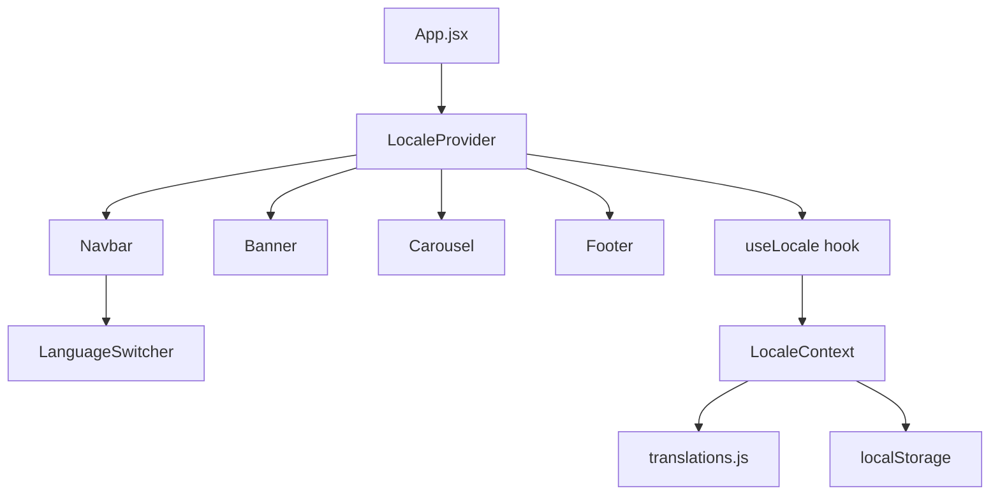

# Design Document: Localization

## Overview

This feature adds multi-language support to the Petal & Bloom React storefront. The implementation uses a lightweight, hand-rolled i18n system — no external library — built on React Context and `localStorage`. Spanish (`es`) is the default and fallback locale. The four supported locales are `es`, `en`, `fr`, and `ko`.

The design avoids over-engineering: a single context provides a `t(key)` lookup function and a `setLocale` setter to every component that needs it. Translation maps are plain JS objects co-located in a single file.

---

## Architecture



### Data flow

1. `App.jsx` wraps all components in `<LocaleProvider>`.
2. `LocaleProvider` reads `localStorage` on mount to restore a saved locale, defaulting to `es`.
3. Any component calls `useLocale()` to get `{ t, locale, setLocale }`.
4. `t(key)` looks up the key in the active locale's translation map, falling back to `es`, then to the raw key.
5. `setLocale(code)` validates the code, updates state, and writes to `localStorage`.
6. `LanguageSwitcher` (rendered inside `Navbar`) calls `setLocale` on user selection.

---

## Components and Interfaces

### New files

| File | Purpose |
|---|---|
| `src/i18n/translations.js` | All four translation maps exported as a single object |
| `src/i18n/LocaleContext.jsx` | React Context definition, `LocaleProvider`, and `useLocale` hook |
| `src/components/LanguageSwitcher.jsx` | Dropdown UI rendered inside Navbar |
| `src/components/LanguageSwitcher.css` | Styles for the switcher |

### Modified files

| File | Change |
|---|---|
| `src/App.jsx` | Wrap children in `<LocaleProvider>` |
| `src/components/Navbar.jsx` | Import `useLocale`, translate links/CTA, render `<LanguageSwitcher>` |
| `src/components/Banner.jsx` | Import `useLocale`, translate all visible strings |
| `src/components/Carousel.jsx` | Import `useLocale`, translate section text, card text, loading/error states |
| `src/components/Footer.jsx` | Import `useLocale`, translate all visible strings |

### `useLocale` hook interface

```js
const { t, locale, setLocale } = useLocale()

// t(key: string) => string
// locale: 'es' | 'en' | 'fr' | 'ko'
// setLocale(code: string) => void  (no-op for invalid codes)
```

### `LocaleProvider` props

```jsx
<LocaleProvider>
  {children}
</LocaleProvider>
```

No props required. Reads/writes `localStorage` key `"pb_locale"` internally.

### `LanguageSwitcher` interface

No props. Reads `locale` and calls `setLocale` via `useLocale()`. Renders a `<select>` element with one `<option>` per supported locale.

---

## Data Models

### Supported locales

```js
const SUPPORTED_LOCALES = ['es', 'en', 'fr', 'ko']
const DEFAULT_LOCALE = 'es'
const STORAGE_KEY = 'pb_locale'
```

### Translation map shape

```js
// src/i18n/translations.js
const translations = {
  es: {
    // Navbar
    'nav.home': 'Inicio',
    'nav.shop': 'Tienda',
    'nav.about': 'Nosotros',
    'nav.contact': 'Contacto',
    'nav.cta': 'Ordenar Ahora',
    // Banner
    'banner.eyebrow': 'Fresco · Artesanal · A Domicilio',
    'banner.title': 'Donde Cada Pétalo',
    'banner.title.accent': 'Cuenta una Historia',
    'banner.sub': 'Ramos curados para cada momento — cumpleaños, aniversarios, o simplemente porque te importa.',
    'banner.cta.primary': 'Comprar Ahora',
    'banner.cta.ghost': 'Explorar Colecciones',
    // Carousel
    'carousel.eyebrow': 'Nuestra Colección',
    'carousel.title': 'Fresco del Jardín',
    'carousel.sub': 'Cada arreglo es elaborado a mano con flores de temporada.',
    'carousel.card.desc': 'Seleccionado con amor, entregado fresco a tu puerta.',
    'carousel.card.quickAdd': 'Agregar Rápido 🛒',
    'carousel.card.addToCart': 'Añadir al Carrito',
    'carousel.tag.bestseller': 'Más Vendido',
    'carousel.tag.new': 'Nuevo',
    'carousel.tag.limited': 'Limitado',
    'carousel.tag.popular': 'Popular',
    'carousel.tag.fresh': 'Fresco',
    'carousel.tag.seasonal': 'Temporada',
    'carousel.loading': 'Cargando...',
    'carousel.error': 'No se pudieron cargar los productos.',
    // Footer
    'footer.tagline': 'Llevando la belleza de la naturaleza a tu puerta, un ramo a la vez.',
    'footer.shop.heading': 'Tienda',
    'footer.shop.bouquets': 'Ramos',
    'footer.shop.seasonal': 'Temporada',
    'footer.shop.gifts': 'Regalos',
    'footer.shop.subscriptions': 'Suscripciones',
    'footer.help.heading': 'Ayuda',
    'footer.help.faq': 'Preguntas Frecuentes',
    'footer.help.delivery': 'Información de Entrega',
    'footer.help.returns': 'Devoluciones',
    'footer.help.contact': 'Contáctanos',
    'footer.newsletter.heading': 'Mantente en Flor',
    'footer.newsletter.desc': 'Recibe ofertas semanales y consejos florales.',
    'footer.newsletter.placeholder': 'tu@email.com',
    'footer.newsletter.btn': 'Suscribirse',
    'footer.copyright': '© 2026 Petal & Bloom. Hecho con 🌹 y mucho amor.',
  },
  en: { /* same keys, English values */ },
  fr: { /* same keys, French values */ },
  ko: { /* same keys, Korean values */ },
}
```

> The actual string values for `en`, `fr`, and `ko` will be filled in during implementation. The key set is identical across all four locales (Requirement 10).

### `t(key)` lookup algorithm

```
function t(key):
  if translations[activeLocale][key] exists → return it
  if translations['es'][key] exists         → return it   (fallback)
  return key                                              (last resort)
```

### localStorage schema

```
key:   "pb_locale"
value: one of "es" | "en" | "fr" | "ko"
```

On load: if the stored value is not in `SUPPORTED_LOCALES`, reset to `"es"` and overwrite.


---

## Correctness Properties

*A property is a characteristic or behavior that should hold true across all valid executions of a system — essentially, a formal statement about what the system should do. Properties serve as the bridge between human-readable specifications and machine-verifiable correctness guarantees.*

### Property 1: Default locale is Spanish

*For any* fresh initialization of `LocaleProvider` where no `pb_locale` key exists in `localStorage`, the active locale returned by `useLocale()` shall be `'es'`.

**Validates: Requirements 1.1, 1.2**

---

### Property 2: Invalid locale is rejected

*For any* string that is not one of `['es', 'en', 'fr', 'ko']`, calling `setLocale` with that string shall leave the active locale unchanged.

**Validates: Requirements 2.3**

---

### Property 3: setLocale updates the active locale

*For any* valid locale code in `['es', 'en', 'fr', 'ko']`, calling `setLocale(code)` shall cause `locale` to equal `code` on the next render.

**Validates: Requirements 3.3**

---

### Property 4: Language switcher reflects the active locale

*For any* valid locale, after `setLocale` is called with that locale, the `<select>` element rendered by `LanguageSwitcher` shall have its `value` equal to that locale.

**Validates: Requirements 3.4, 3.5**

---

### Property 5: setLocale persists to localStorage

*For any* valid locale code, calling `setLocale(code)` shall write `code` to `localStorage` under the key `"pb_locale"`.

**Validates: Requirements 4.1**

---

### Property 6: Locale is restored from localStorage (round-trip)

*For any* valid locale code written to `localStorage["pb_locale"]` before `LocaleProvider` mounts, the active locale after mounting shall equal that code.

**Validates: Requirements 4.2**

---

### Property 7: Navbar renders all text from the active locale

*For any* valid locale, the Navbar rendered under that locale shall display navigation link labels and the CTA button label that exactly match the values in that locale's translation map.

**Validates: Requirements 5.1, 5.2**

---

### Property 8: Banner renders all text from the active locale

*For any* valid locale, the Banner rendered under that locale shall display the eyebrow, headline, subheading, and button labels that exactly match the values in that locale's translation map.

**Validates: Requirements 6.1**

---

### Property 9: Carousel renders all text from the active locale

*For any* valid locale, the Carousel rendered under that locale (including loading and error states) shall display section text, card text, and status messages that exactly match the values in that locale's translation map.

**Validates: Requirements 7.1, 7.2, 7.3**

---

### Property 10: Footer renders all text from the active locale

*For any* valid locale, the Footer rendered under that locale shall display the tagline, section headings, link labels, newsletter copy, input placeholder, button label, and copyright notice that exactly match the values in that locale's translation map.

**Validates: Requirements 8.1, 8.2**

---

### Property 11: Missing key falls back to Spanish

*For any* translation key that exists in the `es` map but is absent from the active locale's map, `t(key)` shall return the Spanish (`es`) value for that key.

**Validates: Requirements 9.1**

---

### Property 12: Key missing from all locales returns the key itself

*For any* string that is not a key in any locale's translation map, `t(key)` shall return that string unchanged.

**Validates: Requirements 9.2**

---

### Property 13: All locales share identical key sets

*For any* translation key defined in the `es` map, that key shall also be present in the `en`, `fr`, and `ko` maps, and vice versa — the four key sets are identical.

**Validates: Requirements 10.1, 10.2**

---

## Error Handling

| Scenario | Behavior |
|---|---|
| `localStorage` contains an unrecognized locale string | Reset to `'es'`, overwrite the stored value |
| `localStorage` is unavailable (private browsing, quota exceeded) | Catch the exception, continue with in-memory locale only |
| `t(key)` called with a key missing from the active locale | Return the `es` value for that key |
| `t(key)` called with a key missing from all locales | Return the raw key string |
| `setLocale` called with an unsupported code | No-op; active locale is unchanged |
| Product API fetch fails (Carousel) | Render `t('carousel.error')` — already translated |

---

## Testing Strategy

### Dual approach

Both unit tests and property-based tests are required. They are complementary:

- **Unit tests** cover specific examples, integration points, and edge cases (e.g., the exact four locales exist, the switcher is inside the Navbar, invalid localStorage is reset).
- **Property tests** verify universal rules across all valid inputs (e.g., `t()` fallback behavior, locale persistence, component rendering correctness for any locale).

### Property-based testing library

Use **[fast-check](https://github.com/dubzzz/fast-check)** — the standard PBT library for JavaScript/TypeScript. Install as a dev dependency:

```bash
npm install --save-dev fast-check vitest @testing-library/react @testing-library/jest-dom
```

Each property test must run a minimum of **100 iterations** (fast-check default is 100; do not lower it).

### Property test tag format

Each property test must include a comment referencing the design property it validates:

```js
// Feature: localization, Property 1: Default locale is Spanish
```

### Property test implementations

Each of the 13 correctness properties maps to exactly one property-based test:

| Property | Arbitrary | Assertion |
|---|---|---|
| P1: Default locale is Spanish | `fc.constant(undefined)` (no storage) | `locale === 'es'` |
| P2: Invalid locale rejected | `fc.string()` filtered to exclude valid locales | `locale` unchanged after `setLocale` |
| P3: setLocale updates locale | `fc.constantFrom('es','en','fr','ko')` | `locale === code` after call |
| P4: Switcher reflects locale | `fc.constantFrom('es','en','fr','ko')` | `select.value === locale` |
| P5: setLocale persists | `fc.constantFrom('es','en','fr','ko')` | `localStorage.getItem('pb_locale') === code` |
| P6: Locale restored (round-trip) | `fc.constantFrom('es','en','fr','ko')` | `locale === stored code` after mount |
| P7: Navbar text | `fc.constantFrom('es','en','fr','ko')` | All nav text matches `translations[locale][key]` |
| P8: Banner text | `fc.constantFrom('es','en','fr','ko')` | All banner text matches `translations[locale][key]` |
| P9: Carousel text | `fc.constantFrom('es','en','fr','ko')` | All carousel text matches `translations[locale][key]` |
| P10: Footer text | `fc.constantFrom('es','en','fr','ko')` | All footer text matches `translations[locale][key]` |
| P11: Fallback to Spanish | `fc.constantFrom('en','fr','ko')` × `fc.string()` key | `t(key) === translations.es[key]` when key missing from active locale |
| P12: Key returns itself | `fc.string()` filtered to non-keys | `t(key) === key` |
| P13: Identical key sets | `fc.constantFrom('en','fr','ko')` | `Object.keys(translations[locale])` deep-equals `Object.keys(translations.es)` |

### Unit test examples

- Translations object has exactly the four expected locale keys (`es`, `en`, `fr`, `ko`)
- `LanguageSwitcher` is rendered inside `Navbar`
- `LanguageSwitcher` renders exactly four `<option>` elements
- Invalid `localStorage` value (`"de"`, `"xyz"`, `""`) is reset to `'es'` on mount
- Carousel loading skeleton renders `t('carousel.loading')` text
- Carousel error state renders `t('carousel.error')` text

### Test file locations

```
flower-store/src/
├── i18n/
│   ├── LocaleContext.test.jsx   # P1–P6, P11–P13, unit examples
│   └── translations.test.js    # P13, key-set completeness
└── components/
    ├── Navbar.test.jsx          # P7, E2, E3
    ├── Banner.test.jsx          # P8
    ├── Carousel.test.jsx        # P9
    └── Footer.test.jsx          # P10
```
