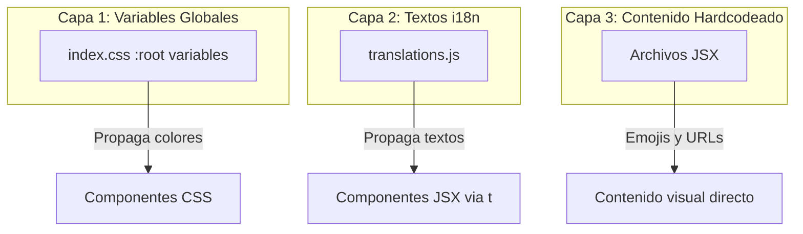
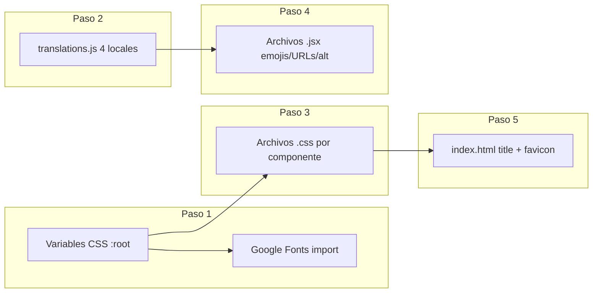

# Documento de Diseño: Videogame Store Theme

## Visión General

Este diseño describe la transformación visual completa del sitio web de florería "El Jardín de Casa Blanca" / "Petal & Bloom" en una tienda de videojuegos. El cambio es exclusivamente de presentación (UI/branding): se modifican colores, tipografía, textos i18n, emojis decorativos, imágenes y metadatos del sitio. No se altera ninguna funcionalidad de backend, estructura de rutas, ni lógica de negocio.

La estrategia central es aprovechar la arquitectura CSS existente basada en variables `:root` en `src/index.css`, de modo que el cambio de paleta se propague automáticamente a todos los componentes que ya referencian esas variables. Los colores hardcodeados en archivos CSS individuales se reemplazan manualmente para completar la coherencia visual.

### Decisiones de Diseño Clave

1. **Paleta neón/oscura**: Se adopta una estética "cyberpunk gaming" con fondo oscuro (#0a0e1a), acentos en azul eléctrico (#00d4ff), púrpura neón (#a855f7), verde neón (#39ff14) y dorado gaming (#ffd700).
2. **Tipografía**: "Orbitron" para encabezados (fuente geométrica futurista) y "Exo 2" para cuerpo (legible, moderna, con personalidad tech).
3. **Nombre de marca**: "Pixel Realm" — corto, memorable, evoca mundos de videojuegos.
4. **Preservación estructural**: No se crean ni eliminan archivos. Solo se modifican los existentes.

## Arquitectura

La arquitectura del proyecto no cambia. El re-theming opera sobre tres capas:



### Flujo de Cambios



### Archivos Afectados

| Archivo | Tipo de Cambio |
|---|---|
| `src/index.css` | Variables `:root`, import de fuentes, font-family |
| `src/i18n/translations.js` | Todos los textos visibles en 4 locales |
| `src/components/Banner.jsx` | Emojis, URLs de imagen, alt text, badges |
| `src/components/Banner.css` | Gradientes, colores hardcodeados |
| `src/components/Carousel.css` | Colores de fondo, tarjetas, arrows, dots |
| `src/components/Navbar.jsx` | Logo texto, emoji/imagen logo |
| `src/components/Navbar.css` | Fondo, colores de enlaces, hamburger |
| `src/components/Footer.jsx` | Logo texto y emoji |
| `src/components/Footer.css` | Gradientes de fondo, colores de texto |
| `src/components/Marketplace.jsx` | Emojis decorativos |
| `src/components/Marketplace.css` | Fondo, tarjetas, filtros, paginación |
| `src/components/ProductDetail.css` | Fondo, skeleton, arrows, dots, sombras |
| `src/components/NotFound.jsx` | Emojis decorativos |
| `src/components/NotFound.css` | Fondo, colores, botón CTA |
| `src/components/Contact.jsx` | Emojis decorativos |
| `src/components/Contact.css` | Fondo, colores, tarjetas |
| `index.html` | `<title>` |
| `public/favicon.svg` | Nuevo favicon gaming |

### Archivos NO Afectados (Preservación Backend)

- `src/firebase/*` — Sin cambios
- `src/utils/*` — Sin cambios
- `src/components/Admin*.jsx/.css` — Sin cambios
- `src/components/ProductForm.*` — Sin cambios
- `src/components/ProductsTable.*` — Sin cambios
- `src/components/BranchPickerModal.*` — Sin cambios
- `src/App.jsx` — Sin cambios (rutas intactas)
- `.env` — Sin cambios

## Componentes e Interfaces

### 1. Sistema de Tema Global (`src/index.css`)

**Cambios:**
- Reemplazar import de Google Fonts: `Playfair Display` → `Orbitron`, `Lato` → `Exo 2`
- Actualizar variables `:root`:

| Variable | Valor Actual | Valor Nuevo | Propósito |
|---|---|---|---|
| `--pink` | `#f472b6` | `#a855f7` | Púrpura neón (acento secundario) |
| `--rose` | `#e11d48` | `#00d4ff` | Azul eléctrico (acento primario) |
| `--green` | `#4ade80` | `#39ff14` | Verde neón (acento terciario) |
| `--dark` | `#1a0a0f` | `#0a0e1a` | Fondo oscuro principal |
| `--cream` | `#fff7f0` | `#0f1328` | Fondo oscuro secundario |
| `--gold` | `#f59e0b` | `#ffd700` | Dorado gaming |

- Actualizar `font-family` en `body` y regla `h1, h2, h3`

**Interfaz preservada:** Los mismos nombres de variables CSS, por lo que todos los componentes que usan `var(--rose)`, etc., se actualizan automáticamente.

### 2. Traducciones (`src/i18n/translations.js`)

**Cambios:** Actualizar valores de texto en los 4 locales (es, en, fr, ko) para todas las claves de UI pública. Las claves `admin.*` permanecen sin cambios.

**Claves principales a actualizar:**
- `banner.*` — Textos hero de videojuegos
- `carousel.*` — Textos de colección/catálogo gaming
- `marketplace.*` — Textos de tienda gaming
- `footer.*` — Textos de footer gaming
- `product.*` — Textos de detalle de producto gaming
- `notfound.*` — Textos de 404 gaming
- `contact.*` — Textos de contacto gaming (eyebrow, title, sub)
- `nav.cta` — CTA de navegación gaming
- `banner.mothers.*` — Textos de banner temático gaming
- `banner.valentines.*` — Textos de banner temático gaming

**Restricción:** El conjunto de claves debe ser idéntico en los 4 locales. No se agregan ni eliminan claves.

### 3. Banner Principal (`src/components/Banner.jsx` + `Banner.css`)

**JSX:**
- `DefaultBanner`: Emojis `🌸🌺🌼🌷🌹💐` → `🎮🕹️👾🏆⚡🎯`
- Imagen hero: URL de bouquet → URL de imagen gaming (ej: setup gaming o consola)
- Badges: Textos hardcodeados → claves i18n con textos gaming
- `MothersDayBanner`: Emojis de flores/corazones → emojis gaming
- `ValentinesBanner`: Emojis románticos → emojis gaming

**CSS:**
- Gradientes de fondo: tonos rosados → tonos oscuros/neón
- Colores hardcodeados (`#e11d48`, `#f472b6`, `#fff0f6`, etc.) → nuevos valores gaming
- SVG wave fill → color coherente con siguiente sección
- Blob decorativo → tonos neón

### 4. Carousel (`src/components/Carousel.css`)

**CSS:**
- Fondo sección: `#fff7f0` → tono oscuro
- Colores de tarjetas, tags, overlays → paleta gaming
- Arrows y dots → colores neón
- Skeletons → tonos oscuros

### 5. Navbar (`src/components/Navbar.jsx` + `Navbar.css`)

**JSX:**
- Logo texto: "El Jardin de Casa Blanca" → "Pixel Realm"
- Logo imagen: Se mantiene `logo.png` o se actualiza referencia

**CSS:**
- Fondo: `rgba(255,247,240,0.92)` → fondo oscuro semi-transparente
- Colores de enlaces, hover, CTA → paleta gaming
- Menú móvil → fondo oscuro

### 6. Footer (`src/components/Footer.jsx` + `Footer.css`)

**JSX:**
- Logo: "🌸 El Jardin de Casa Blanca" → "🎮 Pixel Realm"

**CSS:**
- Gradiente de fondo → tonos oscuros gaming
- Colores de texto, enlaces, headings → paleta gaming

### 7. Marketplace (`src/components/Marketplace.jsx` + `Marketplace.css`)

**JSX:**
- Emojis flotantes: flores → gaming

**CSS:**
- Fondo página → oscuro
- Tarjetas, filtros, paginación, skeletons → paleta gaming

### 8. ProductDetail (`src/components/ProductDetail.css`)

**CSS:**
- Fondo, skeleton, arrows, dots, sombras → paleta gaming
- Colores de texto (nombre, precio, descripción) → coherentes con tema oscuro

### 9. NotFound (`src/components/NotFound.jsx` + `NotFound.css`)

**JSX:**
- Emojis flotantes: `🌸🌷🌺🍃🌼` → `🎮🕹️👾⚡🏆`

**CSS:**
- Fondo, colores, CTA → paleta gaming

### 10. Contact (`src/components/Contact.jsx` + `Contact.css`)

**JSX:**
- Emojis flotantes: `🌸🌷🌺🍃🌼💐` → `🎮🕹️👾⚡🏆🎯`

**CSS:**
- Fondo, colores, tarjetas de sucursal → paleta gaming

### 11. Metadatos (`index.html` + `public/favicon.svg`)

- `<title>`: "El Jardin de Casa Blanca" → "Pixel Realm"
- Favicon: SVG actual (rayo púrpura) → SVG de gamepad o similar

## Modelo de Datos

No hay cambios en el modelo de datos. La transformación es puramente visual. Los productos siguen viniendo de la misma API con la misma estructura:

```typescript
// Estructura existente (sin cambios)
interface Product {
  id: number
  name: string
  price: number
  description?: string
  images: { url: string; displayOrder: number }[]
  tags?: { id: number; name: string }[]
}
```

Las traducciones mantienen la misma estructura de objeto plano `{ [key: string]: string }` por locale, con el mismo conjunto de claves en los 4 locales.


## Propiedades de Correctitud

*Una propiedad es una característica o comportamiento que debe mantenerse verdadero en todas las ejecuciones válidas de un sistema — esencialmente, una declaración formal sobre lo que el sistema debe hacer. Las propiedades sirven como puente entre especificaciones legibles por humanos y garantías de correctitud verificables por máquinas.*

Las siguientes propiedades se derivan del análisis de los criterios de aceptación. Muchos criterios son verificaciones puntuales (examples) sobre archivos específicos — por ejemplo, que el `<title>` en `index.html` diga "Pixel Realm", o que los emojis en `Banner.jsx` sean de videojuegos. Estos se cubren mejor con unit tests específicos. Las propiedades universales que aplican a colecciones de valores son:

### Propiedad 1: Ausencia de colores florales en archivos CSS

*Para cualquier* archivo CSS en `src/` (excluyendo archivos de componentes Admin), ningún valor de color hardcodeado de la temática floral original (`#e11d48`, `#f472b6`, `#fff0f6`, `#fce7f3`, `#1a0a0f`, `#6b3a4a`, `#f9a8d4`, `#f0d6e4`, `#fff7f0`, `#fff0f8`) debe estar presente en el contenido del archivo.

**Valida: Requisitos 1.3, 1.4**

### Propiedad 2: Ausencia de fuente floral en archivos CSS

*Para cualquier* archivo CSS en `src/`, la cadena `Playfair Display` no debe estar presente, confirmando que todas las referencias a la fuente de encabezados original han sido reemplazadas por la nueva fuente gaming.

**Valida: Requisito 2.3**

### Propiedad 3: Ausencia de texto floral y marca antigua en traducciones públicas

*Para cualquier* locale (es, en, fr, ko) y *para cualquier* clave de traducción pública (excluyendo claves `admin.*`), el valor de texto no debe contener palabras de la temática floral original (como "flor", "ramo", "pétalo", "bouquet", "bloom", "petal", "garden", "jardín", "꽃", "부케", "fleur") ni el nombre de marca antiguo ("El Jardin de Casa Blanca", "Petal & Bloom").

**Valida: Requisitos 3.1, 3.2**

### Propiedad 4: Consistencia de claves de traducción entre locales

*Para cualquier* par de locales en el sistema (es, en, fr, ko), el conjunto de claves de traducción debe ser idéntico — es decir, cada clave presente en un locale debe estar presente en todos los demás locales, y viceversa.

**Valida: Requisito 3.10**

### Propiedad 5: Preservación de archivos backend y admin

*Para cualquier* archivo en los directorios `src/firebase/`, `src/utils/`, y *para cualquier* archivo de componente Admin (`AdminAuthGuard.jsx`, `AdminHome.jsx`, `AdminHome.css`, `AdminLayout.jsx`, `AdminLayout.css`, `AdminLogin.jsx`, `AdminLogin.css`, `AdminSidebar.jsx`, `AdminSidebar.css`, `ProductForm.jsx`, `ProductForm.css`, `ProductsTable.jsx`, `ProductsTable.css`, `BranchPickerModal.jsx`, `BranchPickerModal.css`), el contenido del archivo debe permanecer sin modificaciones respecto a su estado original.

**Valida: Requisitos 14.1, 14.3, 14.4**

## Manejo de Errores

No se introducen nuevos flujos de error con este re-theming. Los mecanismos de error existentes permanecen intactos:

- **Carga de productos (Carousel, Marketplace, ProductDetail):** Los estados de loading/error siguen funcionando igual, solo cambian los colores de los skeletons y mensajes de error (vía i18n).
- **Traducciones faltantes:** Si una clave i18n no existe, `t()` retorna la clave misma. La Propiedad 4 garantiza que no haya claves faltantes entre locales.
- **Imágenes rotas:** Si la nueva URL de imagen hero no carga, el navegador muestra el alt text (ahora temático de gaming). No se requiere manejo adicional.
- **Favicon:** Si el nuevo favicon SVG tiene errores de sintaxis, el navegador usa el fallback por defecto. Se valida con un test de ejemplo.

## Estrategia de Testing

### Enfoque Dual

Se utilizan dos tipos de tests complementarios:

1. **Tests unitarios (examples):** Verifican casos específicos y puntuales — que un archivo concreto contenga un valor esperado.
2. **Tests de propiedades (property-based):** Verifican invariantes universales que deben cumplirse para todas las instancias de una colección (todos los archivos CSS, todos los locales, todas las claves).

### Librería de Property-Based Testing

Se utilizará **fast-check** (`fc`) como librería de property-based testing para JavaScript/TypeScript, compatible con el stack de Vitest existente.

### Configuración

- Mínimo **100 iteraciones** por test de propiedad
- Cada test de propiedad debe incluir un comentario referenciando la propiedad del diseño
- Formato de tag: **Feature: videogame-store-theme, Property {número}: {texto de la propiedad}**
- Cada propiedad de correctitud se implementa con un **único** test de propiedad

### Tests de Propiedad

| Propiedad | Qué genera | Qué verifica |
|---|---|---|
| 1: Ausencia de colores florales | Selecciona archivos CSS aleatorios de `src/` (no Admin) | Que no contengan colores hardcodeados florales |
| 2: Ausencia de fuente floral | Selecciona archivos CSS aleatorios de `src/` | Que no contengan "Playfair Display" |
| 3: Ausencia de texto floral en traducciones | Selecciona locale y clave pública aleatorios | Que el valor no contenga palabras florales ni marca antigua |
| 4: Consistencia de claves | Selecciona pares de locales aleatorios | Que sus conjuntos de claves sean idénticos |
| 5: Preservación backend/admin | Selecciona archivos backend/admin aleatorios | Que su contenido no haya sido modificado |

### Tests Unitarios (Examples)

| Componente | Qué verifica |
|---|---|
| `index.css` | Variables `:root` tienen valores gaming, import de Orbitron/Exo 2 |
| `index.html` | `<title>` contiene "Pixel Realm" |
| `Banner.jsx` | Emojis gaming presentes, no emojis florales |
| `Navbar.jsx` | Logo texto es "Pixel Realm" |
| `Footer.jsx` | Logo texto es "🎮 Pixel Realm" |
| `Marketplace.jsx` | Emojis gaming presentes |
| `NotFound.jsx` | Emojis gaming presentes |
| `Contact.jsx` | Emojis gaming presentes |
| `App.jsx` | Rutas preservadas (/, /shop, /product/:id, /contact, /admin/*) |
| `translations.js` | Claves `banner.*` existen en 4 locales con valores gaming |
